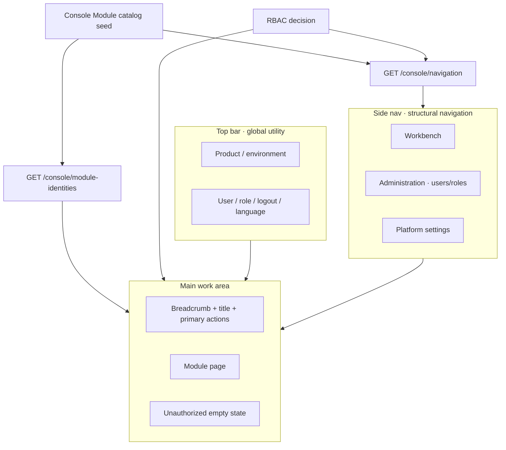

# refraq Business Rules: Management Console Shell

## 1. Scope

This document defines rules for the **Management Console** shell and its business information architecture: responsibilities of the top bar, side nav, and main work area; the relationship between navigation and permissions; and the module registration contract.

It answers what the console business base must provide. It does not prescribe visual styling or frontend component implementation.

Related boundaries:

- **Management Foundation** (login, session, users, roles, permissions) is the enabling layer; rules live in `docs/business-login-auth.md`.
- **Data Product Capabilities** are the product identity; this document only reserves mount points for them and does not define the data-product object model.
- Permission decisions are authoritative in the backend; frontend show/hide only improves UX. See `docs/architecture.md`.
- Navigation catalog decision: `docs/adr/0002-console-navigation-catalog.md`.

Terminology follows `docs/glossary.md`: brand copy in the UI is `Refraq`; the technical identifier is `refraq`.

## 2. Problem And Decision

### 2.1 Current Gap

The Console shell must grow from a flat nav into an extensible base: stable zones, a backend-authoritative module catalog, and permission-filtered navigation — without treating Foundation modules as toggleable apps.

### 2.2 Confirmed Direction

1. **Separate top-bar and side-nav duties** (global utility vs structural navigation)
2. **Permission-driven navigation** from a backend Console Module catalog
3. **Module registration = backend code seed** (not runtime enable/disable, not DB menu CRUD)
4. **Separate Administration and Platform Settings** from future Data Product primary nav
5. **Thin slice / TVP**: Foundation delivers people · permissions · shell · mount contract

Refraq is a domain management system. Top-level Foundation modules are always present; access differs only by Permission. Optional **Plugin** extensions under a module are out of scope for this slice.

## 3. Principles

1. **The Console is the platform product’s primary UI**; the goal is lower cognitive load, not a menu of microservice names.
2. **Foundation delivers people · permissions · shell · mount contract**; the Data Product phase fills that contract with discoverable, requestable, governable capabilities.
3. **Structural navigation lives in the side nav**; account, logout, language, and personal preferences belong in top-bar utility navigation, not the side nav.
4. **Menus are generated from “module catalog × permission decisions”** on the backend; no permission means no entry; deep-link visits must get an explainable unauthorized state.
5. **Frontend and backend share one permission language** (resource + action); UI filtering is not a security boundary.
6. **Management master data (users / roles) and platform settings** stay separate from the future Data Product primary nav.

## 4. Capability Priorities

### 4.1 P0 — Required for Foundation

| Capability | Business meaning |
| --- | --- |
| Unified AppShell zones | Top bar (global utility) + side nav (structural navigation) + main work area |
| Session identity and current-user context | Who is using the console, role summary, logout, and session expiry |
| Permission-driven navigation | `GET /console/navigation` returns only modules the user may access |
| Console Module catalog (code seed) | Modules declare group, routes, actions → permissions, i18n keys in backend code |
| Management IA zones | Workbench, Administration, Platform settings |
| Platform system parameters | Real settings API (session TTL overlay); not an empty nav stub |
| Shared page chrome | Breadcrumb or back, page title, primary actions, content, empty / unauthorized states |
| Consistent authorization semantics | Menus, page actions, and APIs use the same permission catalog |

### 4.2 P1 — Late Foundation or before first Data Product mounts

| Capability | Business meaning |
| --- | --- |
| Scope switcher slot | Top bar reserves org / project / workspace switch |
| Global search slot | Persistent top-bar position |
| Explainable insufficient permission | Prefer hiding entries; on direct visit, say which permission is missing |
| Audit / security foundation entry | Traceable admin-action entry can be thin |
| Persisted Settings Override | Survive restart / multi-replica (deferred from in-process overlay) |

### 4.3 P2 — Defer to Data Product Capabilities

| Capability | Business meaning |
| --- | --- |
| Data product catalog and discovery | Search/browse, owners, trust signals |
| Persona / role-custom navigation | Different jobs see different primary nav |
| Access request and contract / policy workflows | Marketplace-style request, approve, compliance |
| Asset operations and runtime visibility | Runs, lineage, deployment health |
| Entity detail extension slots | One page composing multiple capability widgets |
| Plugin under a Console Module | Optional sub-capability extension (not top-level module toggle) |

## 5. Information Architecture

### 5.1 Top Bar — Global Utility Navigation

| Element | Phase | Notes |
| --- | --- | --- |
| Product mark / environment | P0 | Brand `Refraq`; optional environment distinction |
| Current user and role summary | P0 | Account or display name + role name |
| Logout | P0 | Invalidate session and leave Console |
| Language / personal preferences | P0 | Stay in the top bar; do not move to the side nav |
| Scope switcher | P1 | May hide implementation before multi-scope |
| Global search | P1 | Slot stays stable |
| Notifications | P2 | Placeholder only |

### 5.2 Side Nav — Structural Navigation

The side nav carries only module structural navigation and **renders entries returned by `GET /console/navigation`**.

Groups and modules for this Foundation slice:

| Group | Modules |
| --- | --- |
| Workbench | Home (`dashboard`) |
| Administration | Users, Roles |
| Platform settings | System parameters (`settings`) |

Reserved future groups (Data products / Integration & runtime / Governance) are **not implemented** in this slice (no hide-vs-empty product policy yet).

**Forbidden**: putting account, logout, or language in the side nav; organizing first-level nav by internal service names; treating Foundation modules as enable/disable toggles.

### 5.3 Main — Shared Main Work Area Regions

| Region | Purpose |
| --- | --- |
| Breadcrumb or back | Locate deep resources |
| Title + short description | This page’s business object and purpose |
| Primary action cluster | Show only authorized actions |
| Content area | List / form / detail |
| Status area | Empty list, unauthorized, load failure |

### 5.4 Architecture Sketch

## 6. Module Registration Contract

**Registration** means adding a module to the backend code-seeded Console Module catalog. It is not a runtime admin UI and not an enablement flag.

Each Console Module declaration includes at least:

| Field (business meaning) | Notes |
| --- | --- |
| Module id | Stable technical name (e.g. `users`, `roles`, `settings`) |
| Nav group | `workbench` / `admin` / `settings` / … |
| Routes | List (nav entry) plus optional create/edit paths for SPA wiring |
| Actions | Refine action → Permission; `list` is also the nav visibility permission |
| Label key | i18n key for the module label |
| Group label key | i18n key for the group label |

Rules:

- The shell builds the side nav from navigation API results (catalog × current-user permissions).
- Foundation modules have no enabled/disabled state; visibility is permission-only.
- SPA Refine resources and UX ACL adapt from `GET /console/module-identities` (unfiltered Console Module Identity); the frontend does not hand-maintain a parallel catalog.
- When Data Product modules arrive, extend the backend seed and add pages; do not rewrite top-bar / side-nav duty narrative.

## 7. Platform Settings (System Parameters)

Platform Settings is a real Console Module (`settings`), not a placeholder.

For this slice:

- Readable non-secret parameters include `refraq_env` and effective `admin_session_ttl_hours`
- Writable key: `admin_session_ttl_hours` only (integer 1–168), via **Settings Override**
- Override is in-process: preferred over env at runtime; cleared by explicit delete or process restart; not Store Backend
- TTL changes affect **only sessions created after** the change
- Secrets and initial admin credentials are never exposed
- Permissions: `settings:read` (view / nav), `settings:write` (patch / clear override); seeded `operator` does not include them

## 8. Foundation Vs Data Product Boundary

| Must ship in Foundation | Defer to Data Product phase |
| --- | --- |
| Login / session / logout | Data product object model and catalog browse |
| Users, roles, permission assignment | Domain browse tree, glossary, tag universe |
| Permission-filtered grouped side nav from backend catalog | Persona navigation composer |
| Console Module code-seed contract | Real data-product module content / Plugin under modules |
| Administration and Platform Settings mounts | Self-serve access marketplace, contract editing |
| System parameters API (TTL override) | Persisted multi-replica settings, audit log of patches |
| Top bar: mark, user menu, language | Full global metadata search, notification center |

**Foundation success criteria**:

1. An authorized administrator can complete user / role governance and adjust session TTL.
2. Any signed-in user sees only authorized nav entries; direct visits without permission get explainable feedback.
3. A new Foundation module appears by extending the backend seed (identity + nav) and adding frontend pages/adapters without rewriting shell narrative.

## 9. Anti-Patterns

1. Packing first-level business capabilities into the top bar.
2. Mixing users / roles with future business modules without Administration / Settings zones.
3. Shipping persona composers, widget marketplaces, or theme workshops in phase one.
4. Treating frontend-only menu hiding as the security model.
5. Organizing navigation by internal microservice names.
6. Passing off a full data-catalog IA as the console home.
7. Runtime enable/disable of Foundation modules, or DB-dynamic top-level menus.
8. Writing Settings Override into `core/config.Settings` or pretending in-process override is multi-replica durable.

## 10. Delivery Order (Business)

1. Lock contracts: module catalog fields, navigation API, module-identity API, settings API.
2. Backend: permissions, catalog, navigation, module identities, settings override + effective TTL on login.
3. Frontend: shell consumes navigation; settings page; Refine/accessControl alignment.
4. Defer: reserved nav groups policy, persisted override, audit, Plugins.

Implementation order follows `.process/AGENTS.md`: business rules → API → backend → frontend → verify → update docs.

## 11. References

- `docs/api-contracts-console.md`
- `docs/api-contracts-settings.md`
- `docs/adr/0002-console-navigation-catalog.md`
- Industry notes (non-normative): Refine Authorization, React-Admin Permissions, Cloudscape Service navigation, Grafana-style code navtree + server prune
