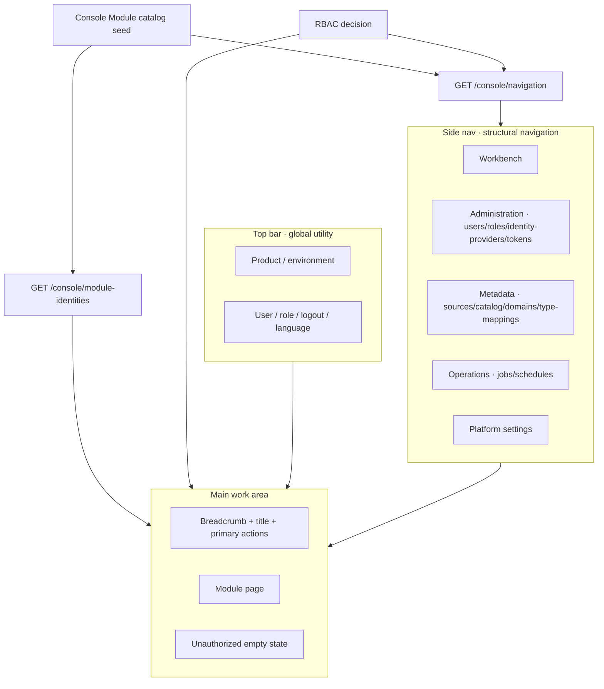

# refraq Business Rules: Management Console Shell

## 1. Scope

This document specifies the **Management Console** shell and its business information architecture: the duties of the top bar, side nav, and main work area; how navigation derives from permissions; and the module registration contract.

It defines what the console business base must provide. It does not prescribe visual styling or frontend component implementation.

Related boundaries:

- **Management Foundation** (login, session, users, roles, permissions) is the enabling layer: `docs/business-login-auth.md`.
- Console shell mounts modules by nav group. Metadata modules mount under `metadata` (`docs/business-metadata.md`); platform **Job** / **Scheduled Task** modules mount under `operations` (`docs/business-jobs.md`, `docs/business-scheduled-tasks.md`). Data Product catalog / Entity modules mount later and stay out of scope here.
- Permission decisions are authoritative in the backend; frontend show/hide only improves UX: `docs/architecture.md`.
- Navigation catalog decision: `docs/adr/0002-console-navigation-catalog.md`. Identity Provider business rules: `docs/business-identity-providers.md`; its API is `docs/api-contracts-identity-providers.md`.
- Site Branding and Brand Attribution: `docs/business-branding.md`; HTTP: `docs/api-contracts-branding.md`.
- Terminology follows `docs/glossary.md`: default brand copy in the UI is `Refraq`; **Site Branding** may replace the primary product mark; the technical identifier is `refraq`.

## 2. Principles

1. **The Console is the platform product's primary UI**; the goal is lower cognitive load, not a menu of internal service names.
2. **Structural navigation lives in the side nav**; account, logout, language, and personal preferences belong in top-bar utility navigation, never the side nav.
3. **Navigation is generated from "module catalog × permission decisions"** on the backend. No permission means no entry; a deep-link visit without permission must get an explainable unauthorized state.
4. **Frontend and backend share one permission language** (resource + action); UI filtering is not a security boundary.
5. **Foundation modules are always present**; access differs only by Permission. They have no runtime enable/disable state, and the top-level catalog is code-seeded, not DB menu CRUD.
6. **Management master data (users / roles / Identity Providers / user tokens) and platform settings** stay in their own zones, separate from the `metadata` group, the `operations` group, and future Data Product primary nav.
7. **A new module appears by extending the backend seed** (identity + nav) and adding frontend pages/adapters — without rewriting the top-bar / side-nav duty narrative.

## 3. Information Architecture

### 3.1 Top Bar — Global Utility Navigation

| Element | Notes |
| --- | --- |
| Product mark / environment | Primary product mark resolved from **Site Branding**; defaults to `Refraq`; optional environment distinction |
| Current user and role summary | Account or display name + role name |
| Logout | Invalidate session and leave Console |
| Language / personal preferences | Stay in the top bar; never move to the side nav |
| Scope switcher | Reserved slot; may hide implementation until multi-scope exists |
| Global search | Reserved slot; position stays stable |
| Notifications | Reserved placeholder |

### 3.2 Side Nav — Structural Navigation

The side nav carries only module structural navigation and **renders exactly the entries returned by `GET /console/navigation`** (catalog × current-user permissions).

| Group | Group id | Modules |
| --- | --- | --- |
| Workbench | `workbench` | Home (`dashboard`) |
| Administration | `admin` | Users, Roles, Identity Providers (`identity-providers`), User PAT (`tokens`) |
| Metadata | `metadata` | Sources (`sources`), Catalog (`catalog`), Business Domains (`business-domains`), Type Mappings (`type-mappings`) |
| Operations | `operations` | Jobs (`jobs`), Schedules (`schedules`) |
| Platform settings | `settings` | System parameters (`settings`), Site branding (`branding`) |

- The `operations` group sits after `metadata` and before `settings`. Module field details: `docs/business-metadata.md`, `docs/business-user-tokens.md`, `docs/business-jobs.md`, `docs/business-scheduled-tasks.md`.
- About is a top-bar user-menu utility, not structural navigation. It carries **Brand Attribution**, is not a Console Module, and is never permission-filtered.
- Data products and Governance groups (and any persona composer) are reserved for later and not implemented. The hide-vs-empty policy for empty future groups is deferred.

**Forbidden**: putting account, logout, or language in the side nav; organizing first-level nav by internal service names; treating Foundation modules as enable/disable toggles; mounting Sources under Administration.

### 3.3 Main — Shared Work Area Regions

| Region | Purpose |
| --- | --- |
| Breadcrumb or back | Locate deep resources |
| Title + short description | This page's business object and purpose |
| Primary action cluster | Show only authorized actions |
| Content area | List / form / detail |
| Status area | Empty list, unauthorized, load failure |

### 3.4 Architecture Sketch

## 4. Module Registration Contract

**Registration** means adding a module to the backend code-seeded Console Module catalog. It is not a runtime admin UI and not an enablement flag.

Each Console Module declaration includes at least:

| Field (business meaning) | Notes |
| --- | --- |
| Module id | Stable technical name (e.g. `users`, `roles`, `settings`) |
| Nav group | `workbench` / `admin` / `settings` / `metadata` / `operations` / … |
| Routes | List (nav entry) plus optional create/edit paths for SPA wiring |
| Actions | Refine action → Permission; `list` is also the nav visibility permission |
| Label key | i18n key for the module label |
| Group label key | i18n key for the group label |

Rules:

- The shell builds the side nav from navigation API results (catalog × current-user permissions).
- Foundation modules have no enabled/disabled state; visibility is permission-only.
- SPA Refine resources and UX ACL adapt from `GET /console/module-identities` (unfiltered Console Module Identity); the frontend does not hand-maintain a parallel catalog.
- Adding a metadata or later Data Product module means extending the backend seed and adding pages — not rewriting the shell duty narrative.

## 5. Platform Settings (System Parameters)

Platform Settings is a real Console Module (`settings`), not a placeholder. It **presents** **System Parameter**s; it does not own the set. Membership, ownership, and lifecycle live in `docs/business-system-parameters.md`; the decision is `docs/adr/0028-system-parameters.md`.

Console rules:

- One route `/console/settings` and one panel rendered from the catalog payload: no second-level Settings nav, no per-key page, no per-key frontend code.
- Each parameter shows a value control driven by its constraint fragment, its `source` (`seed` or `user`), who changed it and when, an apply note, and a per-key reset. Console disables reset when `source` is `seed`; the API still records a change if reset is called. A stored value outside the current constraint is flagged; Reset or a new save clears it.
- Keys needing an operator action outside this page are visually distinguished. After the intent test, this slice has none (`docs/business-system-parameters.md` §5.2).
- The stored value is the effective value; reset restores the product seed; there is no env fallback for these keys.
- Session TTL changes affect **only sessions created after** the write.
- Secrets and initial admin credentials are never exposed.
- Permissions: `settings:read` (view / nav), `settings:write` (write / reset); seeded `operator` does not include them.
- The page presents System Parameters only; reference data with its own lifecycle (**Type Mapping**, Business Domains) stays in its own module.

## 6. Anti-Patterns

1. Packing first-level business capabilities into the top bar.
2. Mixing users / roles with business modules without Administration / Settings zones.
3. Shipping persona composers, widget marketplaces, per-User skinning, per-tenant themes, or theme workshops as part of the shell. The bounded, operator-managed, site-wide **Site Branding** resource is not a theme workshop.
4. Treating frontend-only menu hiding as the security model.
5. Organizing navigation by internal service names.
6. Passing off a full data-catalog IA as the console home.
7. Runtime enable/disable of Foundation modules, or DB-dynamic top-level menus.
8. Keeping a **System Parameter** in two homes — an env baseline with a stored overlay, or an in-process override beside the store.
9. Turning Platform Settings into a junk drawer: temporary rollout switches, per-object knobs, per-**User** preferences, reference data catalogs, or engineering tuning knobs (pool size, loop interval, replica count).
10. Declaring another package's knobs inside the settings mechanism, or having the store call back into domains to apply a value.
11. Hand-writing a page or a bespoke response field per parameter instead of rendering the catalog.

## 7. References

- `docs/api-contracts-console.md`
- `docs/api-contracts-settings.md`
- `docs/api-contracts-branding.md`
- `docs/business-branding.md`
- `docs/business-system-parameters.md`
- `docs/adr/0028-system-parameters.md`
- `docs/business-metadata.md`
- `docs/business-user-tokens.md`
- `docs/adr/0002-console-navigation-catalog.md`
- Industry notes (non-normative): Refine Authorization, React-Admin Permissions, Cloudscape Service navigation, Grafana-style code navtree + server prune
