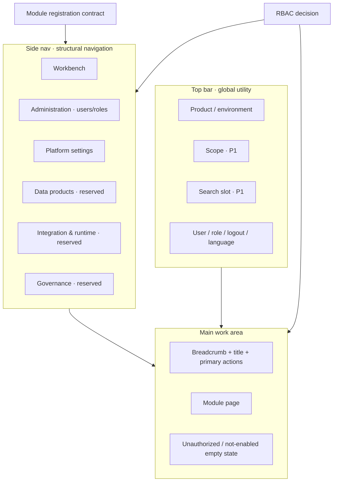

# refraq Business Rules: Management Console Shell

## 1. Scope

This document defines rules for the **Management Console** shell and its business information architecture: responsibilities of the top bar, side nav, and main work area; the relationship between navigation and permissions; and the module registration contract.

It answers what the console business base must provide. It does not prescribe visual styling or frontend component implementation.

Related boundaries:

- **Management Foundation** (login, session, users, roles, permissions) is the enabling layer; rules live in `docs/business-login-auth.md`.
- **Data Product Capabilities** are the product identity; this document only reserves mount points for them and does not define the data-product object model.
- Permission decisions are authoritative in the backend; frontend show/hide only improves UX. See `docs/architecture.md`.

Terminology follows `docs/glossary.md`: brand copy in the UI is `Refraq`; the technical identifier is `refraq`.

## 2. Problem And Decision

### 2.1 Current Gap

The current Console shell is: top bar (title / account / language / logout) + a flat three-link nav (home / users / roles) + main area.

For the Foundation slice, the capability loop is closed. As an extensible console base it is thin: it lacks stable zones, a module registration contract, and navigation slots for later Data Product capabilities.

### 2.2 Confirmed Direction

Shell evolution line (converged industry practice):

1. **Separate top-bar and side-nav duties** (Cloudscape-style global utility vs structural navigation)
2. **Permission-driven navigation** (Refine / React-Admin: module registry × `can(resource, action)`)
3. **Module registration contract** (Backstage plugin idea: register into a predetermined nav group without rewriting the shell narrative)
4. **Separate admin and business zones** (OpenMetadata / DataHub: Settings·Administration vs discovery/operations)
5. **Thin slice / TVP** (CNCF Platforms; Data Mesh thin slice): Foundation delivers only trustworthy people · permissions · shell · mount contract

## 3. Principles

1. **The Console is the platform product’s primary UI**; the goal is lower cognitive load, not a menu of microservice names.
2. **Foundation delivers people · permissions · shell · mount contract**; the Data Product phase fills that contract with discoverable, requestable, governable capabilities.
3. **Structural navigation lives in the side nav**; account, logout, language, and personal preferences belong in top-bar utility navigation, not the side nav.
4. **Menus are generated from “module registration × permission decisions”**; no permission means no entry; deep-link visits must get an explainable unauthorized state.
5. **Frontend and backend share one permission language** (resource + action); UI filtering is not a security boundary.
6. **Management master data (users / roles) and platform settings** stay separate from the future Data Product primary nav so business and governance are not mixed.

## 4. Capability Priorities

### 4.1 P0 — Required for Foundation

| Capability | Business meaning |
| --- | --- |
| Unified AppShell zones | Top bar (global utility) + side nav (structural navigation) + main work area; duties do not mix |
| Session identity and current-user context | Who is using the console, role summary, logout, and session expiry |
| Permission-driven navigation | Side nav renders only module entries the current user may access |
| Resource / module registration contract | New capabilities mount by declaration: nav group, routes, required permissions, admin/settings membership |
| Management information-architecture zones | Separate “Workbench” from “Administration (users · roles)”; not a flat three-link wall |
| Shared page chrome | Breadcrumb or back, page title, primary action cluster, content area, empty / unauthorized states |
| Consistent authorization semantics | Menus, page actions, and APIs use the same permission catalog |

### 4.2 P1 — Late Foundation or before first Data Product mounts

| Capability | Business meaning |
| --- | --- |
| Side-nav group slots | Workbench, Administration, Data Products (may be empty), Platform settings; clear empty-state policy for unopened modules |
| Scope switcher slot | Top bar reserves org / project / workspace switch; keep the mental slot even in single-scope phase (may stay disabled) |
| Global search slot | Persistent top-bar position; this phase may cover only users/roles, or placeholder only |
| Explainable insufficient permission | Prefer hiding entries; on direct visit, say which permission is missing and who can help |
| Audit / security foundation entry | Traceable admin-action entry can be thin, but the conceptual slot stays stable |

### 4.3 P2 — Defer to Data Product Capabilities

| Capability | Business meaning |
| --- | --- |
| Data product catalog and discovery | Search/browse, owners, trust signals |
| Persona / role-custom navigation | Different jobs see different primary nav |
| Access request and contract / policy workflows | Marketplace-style request, approve, compliance |
| Asset operations and runtime visibility | Runs, lineage, deployment health, and similar |
| Entity detail extension slots | One page composing multiple capability widgets |
| Help panel, full multi-workspace UX | Enhanced state; not required for TVP |

## 5. Information Architecture

### 5.1 Top Bar — Global Utility Navigation

| Element | Phase | Notes |
| --- | --- | --- |
| Product mark / environment | P0 | Brand `Refraq`; optional environment distinction |
| Current user and role summary | P0 | Account or display name + role name |
| Logout | P0 | Invalidate session and leave Console |
| Language / personal preferences | P0 | Stay in the top bar; do not move to the side nav |
| Scope switcher | P1 | May hide implementation before multi-scope; IA still reserves the slot |
| Global search | P1 | Slot stays stable; coverage grows by phase |
| Notifications | P2 | Placeholder only; not a Foundation completion criterion |

### 5.2 Side Nav — Structural Navigation

The side nav carries only module structural navigation and **renders authorized entries only**.

Target groups (Foundation may hide unopened groups or show an “not enabled” empty state; pick one product policy before implementation):

| Group | Phase | Content in this phase |
| --- | --- | --- |
| Workbench | P0 | Home / platform overview (admin-task oriented, not a fake data catalog) |
| Administration | P0 | Users, roles (and later permission-related management master data) |
| Platform settings | P0/P1 | Security/session policy, audit entry, system parameters; may merge with Administration under Settings, but conceptually keep “master data” distinct from “system parameters” |
| Data products | Filled in P2 | Catalog, product detail, access requests, etc.; P0 only reserves the slot |
| Integration & runtime | P2 | Connections, sync/runs, deployment health, etc. |
| Governance | Late P1 / P2 | Policies, contracts, glossary/classification, etc. |

**Forbidden**: putting account, logout, or language in the side nav; organizing first-level nav by internal service names.

### 5.3 Main — Shared Main Work Area Regions

| Region | Purpose |
| --- | --- |
| Breadcrumb or back | Locate deep resources |
| Title + short description | This page’s business object and purpose |
| Primary action cluster | Show only authorized actions |
| Content area | List / form / detail |
| Status area | Empty list, unauthorized, module not enabled, load failure |

### 5.4 Architecture Sketch

## 6. Module Registration Contract

New Console capabilities must enter the shell via a module declaration that includes at least:

| Field (business meaning) | Notes |
| --- | --- |
| Module id | Stable technical name (e.g. `users`, `roles`) |
| Nav group | Workbench / Administration / Platform settings / Data products / … |
| Route entries | Business entries such as list / create / edit |
| Required permissions | Permission keys to see the entry and to run actions |
| Label key | i18n key; do not hard-code a single-language string |
| Enabled state | Enabled / not enabled (drives hide vs empty state) |

Rules:

- The shell builds the side nav from “registered and enabled × current-user permissions”.
- Unregistered modules must not live as long-lived hard-coded shell special cases.
- When Data Product modules arrive, add registration entries and pages only; do not rewrite top-bar / side-nav duty narrative.

## 7. Foundation Vs Data Product Boundary

| Must ship in Foundation | Defer to Data Product phase |
| --- | --- |
| Login / session / logout | Data product object model and catalog browse |
| Users, roles, permission assignment | Domain browse tree, glossary, tag universe |
| Permission-filtered grouped side nav | Persona navigation composer |
| Module registration and nav-slot contract | Real data-product plugin content |
| Stable Administration and Settings mounts | Self-serve access marketplace, contract editing, policy-engine UX |
| Top bar: mark, user menu, language; (optional) scope/search placeholders | Full global metadata search, notification center, help panel |
| Unauthorized and not-enabled empty-state policy | Lineage, quality scores, runtime monitoring, AI assistant |

**Foundation success criteria**:

1. An authorized administrator can complete user / role governance.
2. Any signed-in user sees only authorized entries; direct visits without permission get explainable feedback.
3. A new module can appear in a predetermined nav group after registration without rewriting the shell business narrative.

## 8. Anti-Patterns

Explicitly avoid this phase:

1. Packing first-level business capabilities into the top bar; structural navigation must grow in the side nav.
2. Mixing users / roles with future business modules without Administration / Settings zones.
3. Shipping persona composers, widget marketplaces, notification centers, or theme workshops in phase one.
4. Treating frontend-only menu hiding as the security model.
5. Organizing navigation by internal microservice names.
6. Passing off a full data-catalog IA as the console home.
7. Adding many page special cases without a module registration contract.
8. Building full multi-workspace UX before multi-tenant need is clear, then bolting on RBAC later.

## 9. Delivery Order (Business)

1. **Lock the contract**: finalize module registration fields and side-nav group enums (this document §§5–6).
2. **Reshape shell IA**: separate top-bar / side-nav duties; place admin entries under Administration; shared page chrome.
3. **Close the permission-nav loop**: menus and actions all go through the existing permission catalog.
4. **Reserve slots**: Data products / Integration & runtime / Governance — default hide or one shared not-enabled empty state (choose before implementation).
5. **P1 placeholders**: scope switcher slot, search slot (backend optional).
6. **After entering the Data Product slice**: fill catalog, request, contract, operations, and other P2 capabilities.

Implementation order still follows `.process/AGENTS.md`: business rules (this document) → API (if new) → backend → frontend → verify → update docs.

## 10. References

Industry and literature basis (research summary; not implementation dependencies):

**Open source / design systems**

- [Refine Authorization](https://github.com/refinedev/refine/blob/main/documentation/docs/guides-concepts/authorization/index.md)
- [React-Admin Permissions](https://marmelab.com/react-admin/Permissions.html)
- [OpenMetadata Admin / Roles](https://docs.open-metadata.org/latest/how-to-guides/admin-guide)
- [DataHub Access Policies](https://docs.datahub.com/docs/authorization/access-policies-guide)
- [Amundsen](https://github.com/amundsen-io/amundsen)
- [Apache Superset](https://github.com/apache/superset)
- [Airbyte Workspaces / RBAC](https://docs.airbyte.com/platform/using-airbyte/workspaces)
- [Dagster UI](https://docs.dagster.io/guides/operate/webserver)
- [Backstage](https://backstage.io/)
- [Cloudscape App layout / Service navigation](https://cloudscape.design/patterns/general/service-navigation/)

**Papers / white papers**

- Zhamak Dehghani, *How to Move Beyond a Monolithic Data Lake to a Distributed Data Mesh* (2019) — https://martinfowler.com/articles/data-monolith-to-mesh.html
- Zhamak Dehghani, *Data Mesh Principles and Logical Architecture* (2020) — https://martinfowler.com/articles/data-mesh-principles.html
- ThoughtWorks, *The Data Mesh Shift* — https://www.thoughtworks.com/content/dam/thoughtworks/documents/whitepaper/tw_whitepaper_data_mesh_English.pdf
- CNCF TAG App Delivery, *Platforms White Paper* (2023) — https://tag-app-delivery.cncf.io/whitepapers/platforms/
- CNCF TAG App Delivery, *Platform Engineering Maturity Model* (2023) — https://tag-app-delivery.cncf.io/whitepapers/platform-eng-maturity-model/
- *Data Product MCP: Chat with your Enterprise Data* (2026) — https://arxiv.org/abs/2601.08687
